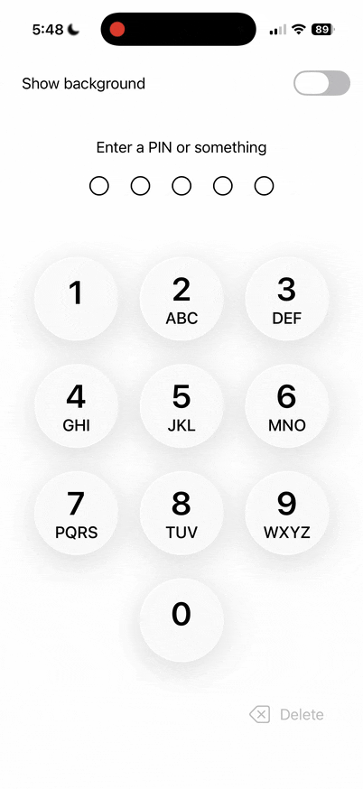

# SwiftUI PIN Pad


A customizable PIN entry component for SwiftUI (iOS 18+, macOS 15+).



## Installation

Add this package to your project via Swift Package Manager:

```swift
dependencies: [
    .package(url: "https://github.com/drewster99/swiftui-pin-pad.git", from: "1.0.0")
]
```

## Demo Project

A demo project is available at [swiftui-pin-pad-demo](https://github.com/drewster99/swiftui-pin-pad-demo).

## Usage

```swift
import swiftui_pin_pad

SwiftUIPINPad {
    Text("Enter PIN")
        .font(.title)
} onPINComplete: { pin in
    guard pin == "1234" else {
        return .indicateInvalidPIN  // Shakes and clears
    }
    // PIN is correct - handle authentication
    return .doNothing
}
```

### With change callback

```swift
SwiftUIPINPad {
    Text("Enter PIN")
} onPINChange: { pin in
    // onPINChange is optional and is fired every time the user
    // adds a digit or deletes one
    
    print("Current PIN: \(pin)")
    return .doNothing
} onPINComplete: { pin in
    // Validate PIN
    if pin == "1234" {
        // Do whatever you need here to remove the
        // pin pad view and allow access
        return .doNothing // or .clearPIN, if you prefer
    } else {
        // wrong pin - shake and clear
        return .indicateInvalidPIN
    }
}
```

### Customization

```swift
SwiftUIPINPad(requiredLength: 6) {
    Text("6-Digit PIN")
} onPINComplete: { pin in
    // Handle 6-digit PIN
    return .doNothing
}
.pinPadIncludesButtonLetters(false)  // Hide ABC/DEF letters
.pinPadButtonSpacing(30)             // Adjust button spacing
```

### Cancel button

```swift
SwiftUIPINPad {
    Text("Enter PIN")
} onPINComplete: { pin in
    return pin == "1234" ? .doNothing : .indicateInvalidPIN
} onCancel: {
    // Handle cancel button press
}

// Or hide the cancel button
SwiftUIPINPad(showCancelButton: false) {
    Text("Enter PIN")
} onPINComplete: { pin in
    return .doNothing
}
```

### External PIN state

```swift
@State private var currentPIN = ""

SwiftUIPINPad(pin: $currentPIN) {
    Text("Enter PIN")
} onPINComplete: { pin in
    return .doNothing
}
```

## Features

- Configurable PIN length (default: 4)
- Optional cancel button with callback
- External PIN state binding
- Shake animation for invalid PIN
- Optional letter labels on buttons
- Customizable spacing
- Keyboard shortcuts: digits, Delete, Escape
- Glass button style on iOS 26+ / macOS 26+

## License

MIT License

## Copyright & Credits

Written by Andrew Benson
Copyright (C) 2025 Nuclear Cyborg Corp
